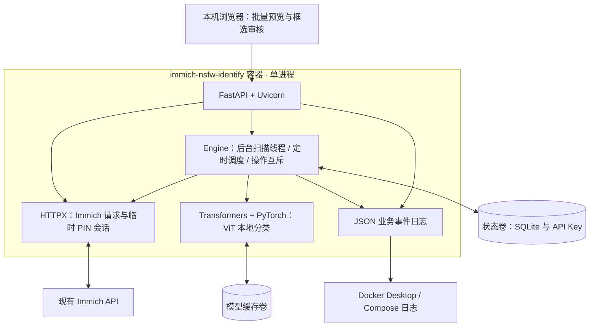

# 🛡️ immich-nsfw-identify

**给 Immich 增加本地 NSFW 识别、人工审核和自动锁定能力。**


[](LICENSE)

在给朋友翻照片之前，先让本地模型找出可能敏感的图片，再由你决定保留还是锁定。项目通过 Immich API 获取预览图，并把确认需要隐藏的照片移入 Immich 的 **锁定文件夹（Locked Folder）**。

> 这是独立部署的社区扩展服务，不是 Immich 官方插件。无需修改 Immich 源码或数据库，也不挂载、移动或删除你的原图。
>
> **当前支持并验证的 Immich 版本：`v3.3.0-rc.0`。** 服务会核对版本，不匹配时停止连接、扫描和修改操作。使用其他版本前需要适配并验证 API。

## 🧭 目录

- [✨ 功能](#-功能)
- [🧩 工作原理](#-工作原理)
- [🏗️ 技术架构与选型](#️-技术架构与选型)
- [🚀 Docker 部署](#-docker-部署)
- [🔑 配置 Immich 权限与 PIN](#-配置-immich-权限与-pin)
- [📖 使用方式与 Immich 中的效果](#-使用方式与-immich-中的效果)
- [⚙️ 阈值、定时扫描与自动模式](#️-阈值定时扫描与自动模式)
- [⚠️ 兼容性与限制](#️-兼容性与限制)
- [🧰 运维与备份](#-运维与备份)
- [📜 查看运行日志](#-查看运行日志)
- [🔧 故障排查](#-故障排查)
- [🧪 开发与测试](#-开发与测试)
- [📄 许可证与致谢](#-许可证与致谢)
- [🗺️ TODO / Roadmap](#️-todo--roadmap)

## ✨ 功能

- 🧠 **本地专用模型**：使用 Falconsai NSFW 分类器，在 CPU 上判断图片；不调用云端识别 API。
- 🔎 **整库与增量扫描**：扫描现有照片，也可定时检查新增上传。
- 🔄 **重新识别**：显式重跑已识别普通照片；保留人工保留和锁定记录。
- 🫣 **模糊预览**：审核页面默认模糊图片，点击「查看」后再显示。
- 👀 **批量查看**：一键显示或重新模糊本页预览；翻页和切换筛选后默认重新模糊。
- 🌐 **跨页清晰模式**：「显示所有预览」让后续页面保持清晰，重新加载浏览器后恢复默认模糊。
- 📑 **分页控制**：24 / 48 / 96 / 192 张每页，支持页码跳转。
- 🖱️ **鼠标框选**：拖拽选择多张图片，Ctrl / Command + 拖拽追加选择，Esc 取消。
- ✅ **人工保留**：记住你的判断，同一文件不重复自动锁定。
- 🔒 **接入 Immich 锁定文件夹**：手动确认后，或开启自动模式后，把符合条件的照片设为锁定。
- ↩️ **恢复记录**：锁定前保存显示状态和可见相册关系；通过账号密码和 PIN 验证后恢复。
- 💾 **持久化**：API Key、设置、扫描结果、操作记录和模型缓存都保存在 Docker 数据卷。
- 📜 **Docker 运行日志**：输出任务进度和结果事件，可从 Docker Desktop 或 Compose 查看。
- 📈 **扫描中实时结果**：候选总数随进度更新；正在选择或查看清晰预览时保留当前页面，并提示新结果。

**默认是审核模式，定时扫描关闭。** 初次部署不会自行扫描或锁定整库。

## 🧩 工作原理

```text
Immich 照片库
      │ 用户 API Key，只读取该账号自己的照片
      ▼
获取预览图 → 本机 NSFW 模型 → 保存分类分数
                                  │
                      人工审核 / 新增照片自动规则
                                  ▼
                    Immich API：移入锁定文件夹
                                  │
                      操作记录 + PIN 验证恢复
```

首次使用需要联网下载约 350 MB 的模型权重。缓存完成后，推理在本机进行；照片不发送给 Hugging Face 或其他外部识别服务。管理页面不保存图片副本。

## 🏗️ 技术架构与选型

### 架构图



### 各层负责什么

| 部分 | 技术 | 职责与选型原因 |
| --- | --- | --- |
| 审核页面 | 原生 HTML / CSS / JavaScript | 查看结果、批量预览、鼠标框选；无需前端构建链或外部 CDN |
| HTTP 服务 | FastAPI + Uvicorn | 提供页面及扫描、保留、锁定、恢复接口，校验输入和本机请求来源 |
| 任务层 | Python 后台线程、定时线程、互斥锁 | 长扫描不占住页面请求；避免扫描分页期间同时修改显示状态；适合单机部署 |
| Immich 接入 | HTTPX | 调用公开 API，设置超时、核对账号和版本，恢复时创建临时 PIN 验证会话 |
| 推理层 | Transformers + CPU PyTorch | 加载固定模型，处理图片并计算 NSFW 分数；直接使用模型原生推理流程 |
| 状态层 | SQLite，WAL + 同步写入 | 单机持久化审核结果和操作记录；锁定前先记录恢复所需信息，无需额外数据库服务 |
| 运行日志 | Python logging → stdout | 由 Docker 收集，便于在 Desktop / Compose 查看，也可在未来接入集中日志系统 |
| 部署 | Docker Compose + 命名卷 | 服务、资源限制和数据存储独立于 Immich，更新代码可保留 Key、记录和模型缓存 |

对 Java Web 开发者来说，可以把 FastAPI 理解为 Controller 层，把 Engine 理解为业务服务加后台执行器，HTTPX 类似服务间 HTTP 客户端。识别任务与网页请求共用一个进程，依靠线程和互斥锁协调。

**当前应保持一个 Uvicorn worker。** 任务进度和互斥锁位于进程内；直接开多个 worker 或副本会分别启动调度器，不能形成统一任务队列。多实例任务协调是后续工作。

### 为什么选 Falconsai 这个模型？

当前使用 [`Falconsai/nsfw_image_detection`](https://huggingface.co/Falconsai/nsfw_image_detection)，它是针对 normal / nsfw 二分类微调的 Vision Transformer（ViT），输入为 **224×224**。

选择它的依据是：

1. **任务匹配**：直接输出普通 / NSFW 分类分数，方便设置审核和自动锁定阈值。
2. **笔记本可运行**：可以用 CPU 推理，适合没有独显的部署主机；当前版本限制单张处理和 CPU 线程数量。
3. **本地隐私**：模型下载后本机处理预览图，避免把个人照片提交给外部识别服务。
4. **接入成本可控**：能直接使用 Transformers / PyTorch 加载；模型缓存独立保存。
5. **许可和版本明确**：模型声明 Apache-2.0，固定 revision，加载 safetensors 权重，并关闭远程模型代码执行。

图像会校正方向并转为 RGB，由模型预处理器调整尺寸、归一化，随后计算分类 logits 和 softmax，取 `nsfw` 类别的分数。工具用这个分数做筛选，最终是否隐藏仍由审核或自动规则决定。

**这是一项适合当前环境的工程选型，还没有完成多模型横向评测。** 模型作者给出的评测结果不能直接当作你的照片库准确率。泳装、健身、医疗、艺术和插画的表现需要实测；缩小整张图片也可能漏掉小范围敏感内容。它目前不提供多个细分内容类别，也不承担年龄或人物身份判断。

**NSFW 并不只指二次元插画，真人照片中的露骨或成人内容同样属于判断范围。** 当前模型的输出只有 normal / nsfw，没有「插画才算 NSFW」的规则，也不区分真人与插画。某张真人图片没有进入候选，可能与模型漏检、预览缩放或分数未达到审核阈值有关，不能由此认定真人不属于 NSFW。可在「所有结果」查看分数，人工审核具体漏判，再调整阈值或评估其他模型。

### 持久状态与运行状态

识别结果、人工保留和恢复记录持久化到 SQLite；当前扫描进度存在进程内。容器重启后，已保存的结果保留，但进行中的任务不会自动从具体照片位置续跑。再次扫描会跳过已处理项目，并尝试重试失败项目。

锁定前先写入操作记录，然后调用 Immich API；请求超时或服务中断时保留未知状态，恢复需要登录并通过 PIN 验证。普通扫描通过预览 API 处理图片，不接触原 Immich 的数据库。

## 🚀 Docker 部署

### 1. 准备环境

- Docker Engine 或 Docker Desktop，支持 `docker compose`。
- 已部署且正在运行的 Immich `v3.3.0-rc.0`。
- 扫描容器能够访问 Immich API。
- 默认最多使用 **2 CPU / 2 GiB 内存**，与 Immich 共用主机时请留出资源。

当前实际验证环境是 Windows 11 + Docker Desktop Linux 容器 + CPU 推理。Linux 的连接配置见下文；尚未在其他宿主系统上做完整实机验证。

### 2. 获取源码

可以从 GitHub 下载源码 ZIP 并解压，或使用 Git：

> 下方 `YOUR_GITHUB_USERNAME` 是仓库地址占位符，请替换为实际 GitHub 用户名后再执行。

```bash
git clone https://github.com/YOUR_GITHUB_USERNAME/immich-nsfw-identify.git
cd immich-nsfw-identify
```

项目可以放在原 Immich Compose 目录旁边；两者作为独立 Compose 项目管理。

```text
immich/
├── immich-app/
├── immich-data/
└── immich-nsfw-identify/
```

### 3. 配置端口和 API 地址

Windows PowerShell：

```powershell
Copy-Item .env.example .env
```

Linux / macOS：

```bash
cp .env.example .env
```

编辑 `.env`：

```dotenv
NSFW_PORT=2983
IMMICH_API_URL=http://host.docker.internal:2283/api
```

| 配置 | 默认值 | 说明 |
| --- | --- | --- |
| `NSFW_PORT` | `2983` | 本机管理页面端口；冲突时修改此值 |
| `IMMICH_API_URL` | `http://host.docker.internal:2283/api` | **从扫描容器内部能访问**的 Immich 地址，保留 `/api` 后缀 |
| `LOG_LEVEL` | `INFO` | 业务日志级别，支持 DEBUG / INFO / WARNING / ERROR |

Immich 默认服务端口是 **2283**，本项目默认管理端口是 **2983**。端口是否冲突取决于你的其他服务，`2983` 不是专用保留端口。

#### 🪟 Windows / macOS Docker Desktop

当 Immich 已把 `2283` 发布到宿主机时，默认的 `host.docker.internal` 地址即可用于访问。不要把容器内的 `127.0.0.1:2283` 当成宿主机：它指向扫描容器自己。

#### 🐧 Linux Docker Engine

保持上面的 `.env` 地址，创建本机 `compose.override.yaml`，添加宿主机网关解析：

```yaml
services:
  scanner:
    extra_hosts:
      - "host.docker.internal:host-gateway"
```

Immich 的已发布端口必须允许容器通过该网关访问。如果 Immich 位于另一台服务器，也可把 `IMMICH_API_URL` 改为容器能访问的内网地址，例如 `http://192.168.1.10:2283/api`。

同一 Docker 网络中的服务也可以通过服务名连接，但需要自行把扫描容器接入该网络。浏览器能打开 Immich，并不一定代表扫描容器也能访问它。

### 4. 构建并启动

在项目根目录执行：

```bash
docker compose up -d --build
docker compose ps
```

打开 **[http://127.0.0.1:2983](http://127.0.0.1:2983)**。

默认容器名为 `immich-nsfw-identify`，镜像由本机源码构建为 `immich-nsfw-identify:local`。本项目暂不提供预构建的 Docker Hub / GHCR 镜像。

管理页面只发布到宿主机回环地址，并校验本机请求来源。默认不能通过局域网 IP 或 Tailscale IP 打开；请在部署主机操作。用户仍在原 Immich App 中浏览照片。

## 🔑 配置 Immich 权限与 PIN

### 创建专用 API Key

1. 用需要扫描照片的账号登录 **Immich 网页端**。
2. 点击头像 → **账号设置（Account Settings）** → **API Key**。
3. 新建专用 Key，例如 `nsfw-identify`，勾选以下权限：

| 权限 | 用途 |
| --- | --- |
| `user.read` | 确认 Key 所属账号，阻止换绑或误操作其他用户 |
| `asset.read` | 列出照片并读取资产信息 |
| `asset.view` | 获取照片预览图，供本机识别和人工审核 |
| `asset.update` | 设置锁定状态，恢复原显示状态 |
| `asset.share` | 恢复照片到原相册时检查资产分享权限 |
| `album.read` | 锁定前记录当前账号可见的相册关系 |
| `albumAsset.create` | 恢复原相册中的照片成员关系 |

不需要 `asset.delete` 等删除权限。完整权限清单用于支持扫描、锁定和恢复工作流程。

4. 把 Key 粘贴到本项目页面，点击 **「验证并连接」**。
5. 连接成功后检查显示的账号是否正确。Key 不会在页面回显，也不写入 `.env`。

一个扫描实例绑定一个 Immich 用户，分享进来的其他账号照片不会被扫描。需要服务多个用户时，应部署各自独立的实例，并为其配置不同的 Compose 项目名、容器名、主机端口和状态卷。

### 配置锁定文件夹 PIN

在 Immich 网页或 App 中打开 **锁定文件夹（Locked Folder）**，按提示设置 **6 位 PIN**。不同语言和客户端版本的导航文字可能略有不同。

扫描不需要提供 PIN。执行锁定前，服务会检查该账号是否已经设置 PIN；恢复时才需要输入密码和 PIN。

## 📖 使用方式与 Immich 中的效果

### 推荐的第一次使用流程

1. 确认当前为 **审核模式**。
2. 保持默认「先扫描 100 张」，点击 **「开始扫描」**。
3. 在「待审核候选」查看分数；点击图片上的「查看」，或「显示本页预览」批量取消模糊。
4. 误判的图片选择 **「保留所选」**；确实需要隐藏的图片选择 **「锁定所选」**。
5. 用少量照片验证效果和恢复方式后，再选择扫描整个照片库。

### 按钮与状态对照

| 本工具中的操作 | 本工具记录什么 | 对应 Immich 中的实际效果 |
| --- | --- | --- |
| **开始扫描（审核模式）** | 保存模型分数，生成审核候选 | 不改变显示状态；不创建相册，不移动、删除原图 |
| **重新识别整个照片库** | 重新运行已识别的普通照片，逐张更新分数 | 本次仅评分，不自动锁定；人工保留、已锁定和待确认状态保持原记录 |
| **刷新结果** | 加载最新分类结果，重置本页选择和清晰预览 | 不改变 Immich 中的任何状态 |
| **查看 / 模糊** | 临时切换本页面预览 | 仅影响本页面，Immich 中没有变化 |
| **显示 / 模糊本页预览** | 批量切换当前页图片的模糊效果 | 不改变 Immich 权限或锁定状态；后续页面按跨页清晰模式决定显示效果 |
| **显示所有预览 / 恢复默认模糊** | 在当前浏览器会话启用 / 关闭跨页清晰模式 | 仅影响可读预览的模糊效果，不解锁照片；浏览器重新加载后关闭 |
| **跳转页 / 每页数量** | 改变当前筛选的分页位置及页大小，重置当前选择 | 不改变照片、模型分数或 Immich 状态 |
| **鼠标拖拽框选** | 更新当前页选择集合 | 不调用 Immich 修改接口；只在后续点击保留或锁定后执行对应操作 |
| **保留所选** | 标记为人工保留 | 照片仍保持原状态；同一文件之后不会因本工具自动模式而被锁定 |
| **锁定所选** | 先记录原状态和可见相册关系，再记录锁定结果 | 移入 **锁定文件夹**，从正常时间线隐藏，并退出所有原相册；不是归档，也不是删除 |
| **恢复** | 记录恢复进度；成功后标为人工保留 | 恢复至锁定前的时间线或归档状态，并尝试重新加入原相册 |
| **停止** | 请求停止当前扫描任务 | 等当前图片处理完成后停止；已经完成的扫描或锁定不会因此撤销 |
| **自动模式 + 扫描** | 对符合新增条件的高分图片记录锁定操作 | 自动移入锁定文件夹；其他图片保持审核或原状态 |

**锁定所选与在 Immich 中手动选择「移至锁定文件夹」使用同一种资产状态。** 锁定后的照片应在 Immich 的锁定文件夹中查看，并按客户端要求验证 PIN / 生物识别。本工具不会用普通 API Key 绕过锁定验证获取预览。

手动锁定实况照片时，关联视频也一起锁定；模型仅检查静态图片，动态部分未经过分类。锁定会移除相册成员关系，不能继续把锁定照片作为普通相册成员分享。

### 🖱️ 批量审核交互

- **显示本页预览**：显示当前页所有可读预览，不会解锁已锁定照片，也不会切换到其他页面。
- **显示所有预览**：当前页及后续翻页、筛选、结果刷新都保持清晰；再次点击「恢复默认模糊」关闭。该模式只在当前页面内存中保存，重新加载浏览器后恢复默认。
- **模糊本页预览**：重新模糊当前页，方便离开屏幕前恢复显示状态。
- **普通鼠标左键拖拽**：拖出矩形，选中与矩形相交的可操作图片，替换原选择。
- **Ctrl / Command + 拖拽**：保留已有选择并追加框选图片。
- **Esc**：取消正在进行的框选，恢复拖拽前的选择。
- 勾选框和「选择本页候选」仍可使用；已锁定、未检测等不可操作项目不会被框选。
- 框选只处理鼠标，手机触摸继续用于滚动和点击勾选，不接管滑动操作。

分页区可选择每页 24 / 48 / 96 / 192 张，默认 48 张；输入合法页码并点击「跳转」可直接前往对应页。更换每页数量会回到第一页，翻页和跳转会清空本页选择；跨页清晰模式保持不变。空结果显示 1 / 1，结果减少后会将页码调整到最后一个有效页。

开启跨页清晰模式后，「模糊本页预览」只临时模糊当前页，下一次翻页或刷新结果仍按清晰模式显示。该模式不会一次下载整个照片库，预览仍按页加载。

扫描中，候选总数随状态轮询更新，列表约每 6 秒检查是否需要刷新。已有选择、正在框选、查看清晰预览或打开恢复窗口时，列表不会自动重排；会显示「有新结果待刷新」。点击「刷新结果」可立即更新，当前选择及清晰预览会重置。

### ↩️ 恢复误判

1. 在本工具的 **「锁定与恢复记录」** 找到操作，点击 **「恢复」**。
2. 输入同一 Immich 账号的邮箱、密码和 6 位锁定文件夹 PIN。
3. 服务创建临时会话、验证 PIN，恢复原显示状态及记录中的相册关系。
4. 操作结束时尝试锁定并退出临时会话；密码、PIN 和会话 Token 不持久保存。

恢复到共享相册后，那个相册的成员也可能再次看到照片。已删除或失去权限的相册无法保证恢复；无权读取的相册关系无法提前记录。部分恢复失败会保留操作记录，可以解决权限问题后重试。

记录区域显示最近 100 次操作。锁定不是加密：服务器所有者仍能从原存储读取文件。

## ⚙️ 阈值、定时扫描与自动模式

| 设置 | 默认值 | 作用 |
| --- | --- | --- |
| 待审核阈值 | `0.70` | 达到此分数的图片进入待审核候选 |
| 自动锁定阈值 | `0.95` | 自动模式下，符合新增条件且达到此分数才尝试锁定 |
| 运行模式 | 审核 | 由用户确认后才锁定 |
| 定时扫描 | 关闭 | 开启后按设定间隔增量检查 |
| 扫描间隔 | 15 分钟 | 可设置为 5–1440 分钟 |

**模型分数不是准确率，也不是适用于所有照片库的保证。** 先查看结果，再根据误判、漏判情况调整阈值。低于审核阈值的图片仍能在「所有结果」查看。

开启自动模式时需要在页面确认并保存设置。自动规则如下：

- 🆕 只处理**启用自动模式之后上传**的图片，按上传时间判断；刚上传的旧照片也属于新增。
- 📚 原有照片库不追溯自动锁定，仍可人工审核。
- 🧩 相册内、堆叠内和实况照片留待人工审核；视频和动画不分类。
- ✅ 已人工保留且文件未变化的照片不自动锁定。
- ⏱️ 自动模式本身不会立刻启动扫描：需点击扫描，或另外开启定时扫描并保存。

「先扫描 100 张」按拍摄时间取近期项目，用于试模型；「扫描整个照片库」建立全量结果。「增量扫描新增照片」依据已完成扫描的上传时间水位，并重叠 10 分钟检查。没有完成的全量水位时，第一次增量扫描会先检查整个库。有限的 100 项扫描不会更新增量水位。

普通整库扫描会跳过已成功识别的项目。需要实际重新跑模型时，选择 **「重新识别整个照片库」**，点击开始并确认。本轮始终只更新分数，不自动锁定，也不会删除原图或抹去恢复记录；人工保留、已锁定和状态待确认的项目不会重跑。

## ⚠️ 兼容性与限制

- **版本限制**：仅验证 `v3.3.0-rc.0`，版本不匹配会停止任务。不要为了使用本工具未经评估地降级 Immich。
- **视频 / 动画**：普通视频、GIF 和带时长的动画标为未检测，不用封面分数代替完整视频判断。
- **识别范围**：当前模型是整图二分类（normal / nsfw），输入为 224×224。泳装、医疗、艺术、插画等可能误判；小区域内容可能漏掉。
- **显示窗口**：识别发生在上传后，新照片在被扫描前可能暂时显示。这不是上传前拦截，也不能保证隐藏全部 NSFW 内容。
- **相册恢复**：只尽力恢复提前记录且当前有写权限的关系，不保证恢复所有原相册。
- **OAuth-only 账号**：本页面恢复需要密码登录，暂不支持只使用 OAuth 且没有本地密码的账号。
- **请求中断**：超时可能意味着状态未知；工具保留「结果待确认」记录，不把它当作成功。可使用受 PIN 保护的恢复操作核对。
- **本机访问**：管理页面没有提供多人远程管理的登录系统，默认只允许本机访问。

## 🧰 运维与备份

所有命令在项目根目录执行。

```bash
# 构建 / 启动 / 应用配置变更
docker compose up -d --build

# 查看状态和日志
docker compose ps
docker compose logs --tail 50 scanner

# 停止扫描服务，保留容器和数据卷
docker compose stop

# 再次启动
docker compose start

# 移除项目容器和网络，保留数据卷
docker compose down
```

源码更新后，先确认没有扫描任务，再运行 `docker compose up -d --build`。停止本项目不影响原 Immich 服务。

### 持久数据

全新部署默认创建：

| 数据卷 | 内容 | 备份建议 |
| --- | --- | --- |
| `immich-nsfw-identify_nsfw-state` | API Key、设置、SQLite 扫描结果和恢复记录 | 需要备份，包含敏感凭据；建议停服务后备份整个卷 |
| `immich-nsfw-identify_nsfw-model` | 模型缓存 | 可重新下载，无需频繁备份 |

API Key 在状态卷中以权限 `600` 的明文文件保存；本机管理员及拥有 Docker 权限的人仍可能读取。不要公开数据卷、状态备份、`.env` 或本机 `compose.override.yaml`。

**不要执行 `docker compose down -v`**：全新部署的项目数据卷会被删除，Key、结果和恢复记录会丢失。外部卷一般不随 `down -v` 删除，但仍应将删除卷视为单独的数据清理操作。

从旧部署迁移的机器可以使用 Git 忽略的 `compose.override.yaml` 指定原卷；实际卷名以 `docker compose config` 为准。公开的基础 Compose 不依赖任何既有卷。普通重建不会要求重新下载已缓存的模型。

> 本工具的状态备份不能代替 Immich 本身的原图和数据库备份。

## 📜 查看运行日志

### Docker Desktop：不需要进入容器

打开 **Docker Desktop → Containers → immich-nsfw-identify → Logs**。如果界面按 Compose 项目分组，先展开项目，再选择其中的扫描容器。

容器内程序写出的 stdout / stderr 由 Docker 收集，Logs 页面直接显示。无需 `docker exec` 进入容器查找日志文件，也不需要为这个单机服务安装 Kubernetes。

### 命令行

在项目目录执行：

```bash
# 实时跟踪，并先显示最近 100 行
docker compose logs -f --tail 100 scanner

# 查看最近 10 分钟
docker compose logs --since 10m --tail 200 scanner

# 查看当前容器日志，与在项目目录使用 Compose 等价
docker logs --tail 100 immich-nsfw-identify
```

`Ctrl+C` 只结束实时日志跟踪，不停止容器。这里的 Compose 服务名是 `scanner`，容器名是 `immich-nsfw-identify`。

| 你熟悉的 Kubernetes 概念 | 本项目的 Docker 用法 |
| --- | --- |
| `kubectl logs -f <pod>` | `docker compose logs -f scanner` |
| 程序写到标准输出，运行时收集 | Python 业务日志写到 stdout，Docker 日志驱动收集 |
| 集中平台长期检索日志 | 将来可接入日志采集服务；当前使用本机 Docker 日志 |

### 日志中能看到什么

业务事件使用一行 JSON，时间戳为 UTC：

```json
{"timestamp":"2026-10-02T12:00:00.000+00:00","level":"INFO","event":"scan.progress","job_id":"example-job","processed":250,"skipped":32,"errors":0}
```

上面是示意日志。实际事件包括：

- `service.started` / `service.stopping`：服务生命周期。
- `model.loading` / `model.ready` / `model.failed`：模型加载状态。
- `scan.started` / `scan.progress` / `scan.completed` / `scan.stopped` / `scan.failed`：任务开始、进度及结果。
- `scan.item_failed`：单项处理失败，包含异常类型和可用的 HTTP 状态码。
- `lock.*` / `restore.*`：锁定、恢复、未知或部分失败状态，操作 ID 可对应恢复记录。
- `review.kept` / `settings.saved` / `scheduler.triggered`：保留、设置及定时触发。

扫描进度按每 25 个处理项目或约 30 秒一次节流，在下一个项目处理结束时检查；不是每张照片都刷一条成功日志。INFO 为正常事件，WARNING 为单项失败或需审核情况，ERROR 为任务失败或未知状态。

为避免泄露隐私，业务日志只输出允许的字段：计数、任务/操作 ID、模型版本、设备、异常类型和 HTTP 状态等。**不输出 API Key、密码、PIN、原始请求或响应体、照片文件名、图片路径和图片内容。** 具体照片与审核结果仍在本机页面查看。

### 日志保存与轮转

Compose 为本容器设置 `local` 日志驱动，轮转配置为每个文件 `10m`、最多 `3` 个文件。配置仅影响本项目，不修改 Docker 全局设置。`.env` 中的 `LOG_LEVEL` 可控制业务日志级别，修改后重建容器生效；默认 INFO，DEBUG 也不会开启凭据或图片内容输出。

运行日志用于排查问题，恢复记录则在 SQLite 状态卷中持久保存。重建或删除容器会丢失旧容器的运行日志；日志不是持久审计账本。新版本开始产生任务日志，不会补写之前扫描的历史日志。

参考：[Compose logs](https://docs.docker.com/reference/cli/docker/compose/logs/)、[Docker 日志驱动](https://docs.docker.com/engine/logging/configure/)。

## 🔧 故障排查

| 问题 | 检查方法 |
| --- | --- |
| `2983` 被占用 | 修改 `.env` 中的 `NSFW_PORT`，重建后使用新主机端口访问 |
| 无法连接 Immich | 核对 `IMMICH_API_URL` 含 `/api`，且地址从容器内部可达；确认 Immich 正常运行 |
| API Key 无效或权限不足 | 核对账号与上述七项权限；需要时创建新 Key，并在页面重新验证 |
| 预览图读取失败 | 检查 `asset.view` 权限及 Immich 缩略图任务；稍后重新整库扫描可重试失败项 |
| 模型一直未就绪 | 首次下载需访问 Hugging Face；检查网络、资源和任务错误提示 |
| 没有待审核结果 | 查看「所有结果」，检查是否均低于审核阈值或属于未检测类型 |
| 扫描中候选列表没有变化 | 先看实时总数；有选择或清晰预览时列表会暂缓刷新，点击「刷新结果」更新 |
| 不允许锁定 | 先在 Immich 设置锁定文件夹 PIN；确认照片仍属于当前账号且没有被其他操作隐藏 |
| 恢复失败 | 检查同一账号密码、6 位 PIN、相册写权限及操作记录中的原因 |
| 版本不匹配 | 先适配和测试当前 Immich API；仅修改版本常量不代表完成兼容验证 |

可以从容器内部检查 Immich 的公开版本接口：

```bash
docker compose exec scanner python -c "from src.immich import Immich; c=Immich(); print(c.version()); c.close()"
```

分享日志或提交问题时，请去掉 API Key、密码、PIN、私人照片和可识别个人的信息。

## 🧪 开发与测试

```text
immich-nsfw-identify/
├── src/                   # API、分类器、扫描任务和状态记录
├── static/                # 本机审核页面
├── tests/                 # API、账户边界、锁定 / 恢复等测试
├── scripts/               # 干净源码包生成工具
├── compose.yaml
├── Dockerfile
├── requirements.txt
├── .env.example
├── LICENSE
└── THIRD_PARTY_NOTICES.md
```

构建后运行测试，测试容器不挂载真实状态卷、不读取用户 Key：

```bash
docker compose build
docker run --rm --entrypoint python immich-nsfw-identify:local -m pytest -q tests

# 如本机安装了 Node.js，可执行框选几何测试
node --test tests/review_controls.test.cjs
```

当前测试覆盖审核模式不修改照片、账号隔离、视频跳过、人工保留、增量边界、锁定前记录、超时未知状态、实况配对、部分恢复重试、PIN 临时会话清理、日志字段隐私和框选集合计算。批量预览和鼠标交互使用独立合成色块页面验证，不操作真实照片。模型真实推理曾通过合成图验证；这不代表所有照片分类准确。

另覆盖重新识别的缓存重跑、受保护状态保留、审核模式约束，以及扫描中刷新不打断审核交互。favicon 使用本项目的 SVG 几何图标，包含 PNG / ICO 兼容资源；可用 `python scripts/create_favicon.py` 重新生成位图资源（需要 Pillow）。

### 📦 准备公开源码

用 Git 管理时，`.gitignore` 会排除本机配置、备份、状态、缓存和研究记录。也可以运行以下命令生成只包含公共源码的 ZIP：

```bash
python scripts/package_source.py
```

输出为 `dist/immich-nsfw-identify-source.zip`。如果要手动打包上传，请使用这个源码包，避免将本机数据一起压缩。生成包不包含模型权重、API Key、迁移配置或状态备份。

欢迎通过 Issues 和 Pull Requests 改进版本兼容、模型评估和视频支持。请提供 Immich 版本、宿主系统、复现步骤和脱敏错误信息。

## 📄 许可证与致谢

项目代码采用 [MIT License](LICENSE)，Copyright © 2026 immich-nsfw-identify contributors。

模型和依赖保留各自许可：Falconsai 模型声明为 **Apache-2.0**，不随项目源码或镜像分发。[第三方声明](THIRD_PARTY_NOTICES.md) 列出模型、固定 revision 和许可说明。

- 📷 [Immich](https://github.com/immich-app/immich)：照片库、客户端和 API。
- 🧠 [Falconsai NSFW 模型](https://huggingface.co/Falconsai/nsfw_image_detection)：本地图片分类。
- 📚 [对应版本的 Immich API 定义](https://raw.githubusercontent.com/immich-app/immich/v3.3.0-rc.0/open-api/immich-openapi-specs.json)。

本项目不代表 Immich 官方，也未声称获得其背书。

## 🗺️ TODO / Roadmap

以下是**计划中的能力，当前版本尚未实现**。

### 🎮 GPU 加速与家用主机部署

- [ ] 提供独立 GPU 镜像 / Compose 配置，优先验证 NVIDIA CUDA 和容器 GPU 透传。
- [ ] 增加 CPU / GPU 设备选择、实际设备展示、批量推理和显存限制。
- [ ] 验证不同显卡与 CUDA / PyTorch 组合；其他 GPU 后端另列兼容范围。
- [ ] 补充从笔记本迁移至家用主机的状态卷、模型缓存和 Immich API 地址迁移步骤。

当前镜像安装的是 **CPU 版 PyTorch**，即使主机有独显也不会自动启用 GPU。迁移到家里后，需要 GPU 版本和配置才能获得相应加速。

### 🎬 视频与动态内容检测

- [ ] 增加 FFmpeg 抽帧：可配置采样间隔、每段最大帧数和长视频资源限制。
- [ ] 复用图片分类器检查抽出的帧，研究多帧聚合规则，减少单帧误判和短片段漏检。
- [ ] 支持实况视频与动画检测，并在结果中展示帧时间点和视频级判定。
- [ ] 增加视频任务进度、中断续扫、重试以及媒体格式错误处理。
- [ ] 为视频锁定、实况配对和恢复增加独立测试。

**视频支持需要抽帧与多帧判定流程，GPU 加速是另一项能力。** CPU 也能执行抽帧和逐帧分类，但大库吞吐可能较低。采样检测仍可能漏掉未抽取到的短片段，不能承诺检查全部视频内容。

### 🧠 模型评估与任务能力

- [ ] 建立脱敏评测集，对误判、漏判和 CPU / GPU 吞吐做可复现评估。
- [ ] 支持替换模型或组合分类器，并按模型版本管理结果与阈值。
- [ ] 适配更多 Immich 版本，提供版本兼容测试矩阵。
- [ ] 增加持久任务队列与断点恢复，再考虑多个 worker / 副本部署。
